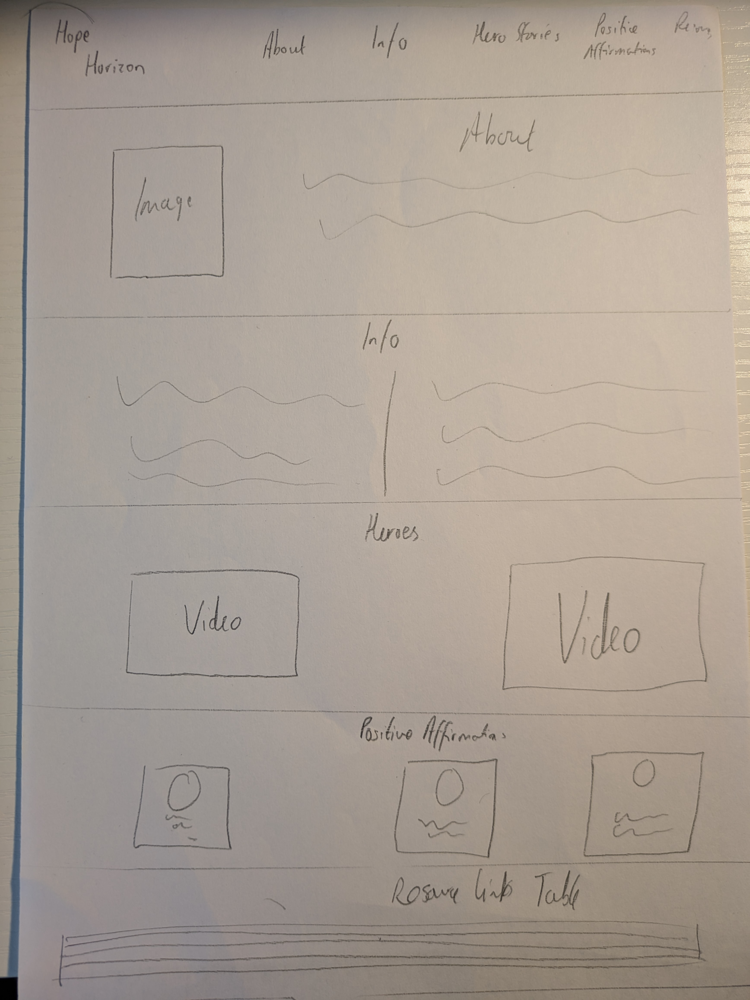

# Hope-Horizon Overview
Hope Horizon is an inclusive platform targeted at all adults to promote mental health awareness, offering resources, and fostering a sense of inclusion for individuals on their journey towards emotional wellbeing. I have included an information section to give surface level information regarding mental health issues, hero stories in the form of videos to give inspiration to anyone struggling, positive affirmations as well as resource links. 

# List of Features 

The navigation bar links through smooth scrolling to the About , Info, Hero Stories, Positive Affirmations, and Resource links.

The Horizon image depicts the hope above the horizon, slightly mor epositive messaging than the light at the end of the tunnel.

The About section details what the website's purpose is and gives the user an idea of what to expect for the forthcoming website

The information section details specific mental health disorders and how to manage one's mental health. This wass included to aid those struggling with or without a diagnosis. Please note Chat GPT was used to create all informative texts. 

The hero stories section was included as a video section to give the user a break from reading. Two stories were included which were found on YouTube. Here are the links: 1) https://www.youtube.com/watch?v=23ZXCYPE0Ks and 2)https://www.youtube.com/watch?v=X2_oTLasXu0

Again for the positive affirmations section I decided to give the user a break from reading too much information and supply some inspiring quotes alongside their authors. 

The images were found of:

1) Nelson Mandela at : https://karsh.org/photographs/nelson-mandela/
2) Maya Angelou at : https://www.culturehoney.com/womens-history-month-tribute-maya-angelou-2/
3) Mother Teresa: https://www.biography.com/religious-figures/mother-teresa

And finally the resource links section was included in a table format for ease of digestion and formatting. This provides the user with useful links if they were struggling or know of someone who might be. 

# User Experience 

Whilst I was unable to use Balsamiq, I drew out the wireframe for the simple website on paper. There are 7 sections - a nav bar, footer, and 5 portions of the webstie with text, images and videos. I incorporated multimedia in my design to prevent the user from reading too much information all at once. The colour scheme of light blue and light transparent yellow was used to provide a calming colour scheme to the website due to the nature of the topic at hand. 

The site is presented in a minimalist manner to present thebuser with all of the necessary information wihtout being flumoxed by too many tools. 

Smooth scrolling was implemented on the website so that the nav bar scrolls smoothly to the appropriate section once clicked.

Videos were included to give the user breaks from reading too much content, and the design of images in the hero stories was made circular to give a portrait effect which I believe to be aesthetically pleasing. 

#Future Features

Given the constraint of time, I made the website very simplistic and for future features, I consider the addition of some form of blog section. 

Furthermore, I think that mulitple pages to the website would aid in navigation of the wesbite and means that information at the bottom of the website is not missed as easily. 

#Future Improvements (Bugs and Fixes)

I found bugs throughout the project and fixed them accordingly. However, I found it difficult to remove the white space oat the top of the website under the nav bar and above the About section. 

The colour scheme of the footer always needs amendment to match the style of the page. 

I also forgot to compress the images and thus the lighthouse perfmance rating was rather poor. 

#Testing 

The W3C Validator came back with no bugs and fixes for both my HTML and CSS code. 

Manually Testing, the videos play when prompted, and the nav bar works when clicked. OTher than that, there is not much interactvity in my website. 

The lighthouse report came back decent although there was room for improvement on best practices.

#Credits 

Credits have been produced through the README but I'd like to credit the use of AI tools such as Mcirosoft CoPilot and Chat-GPT for aid with producing tet, finding video urls and debugging code. 
